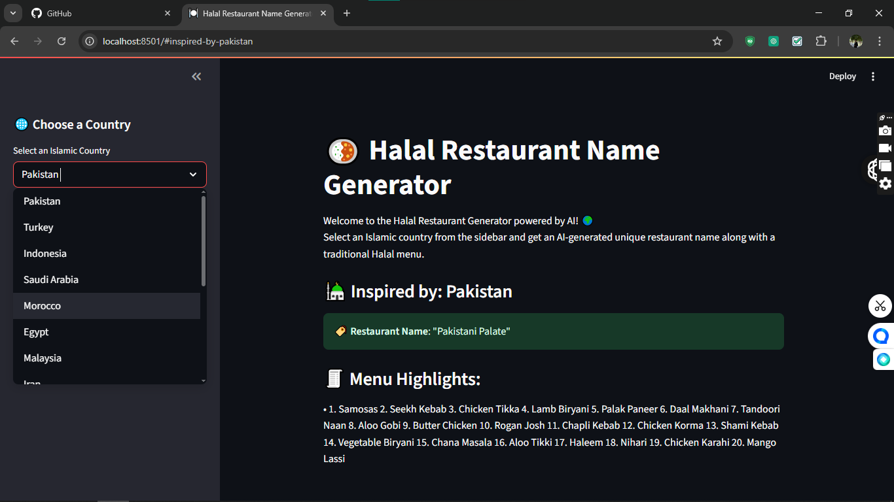
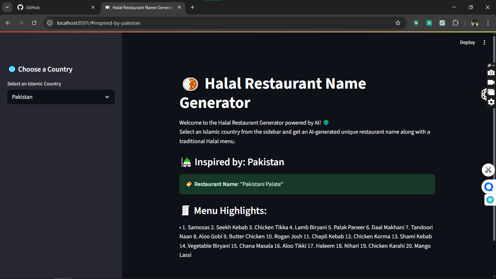
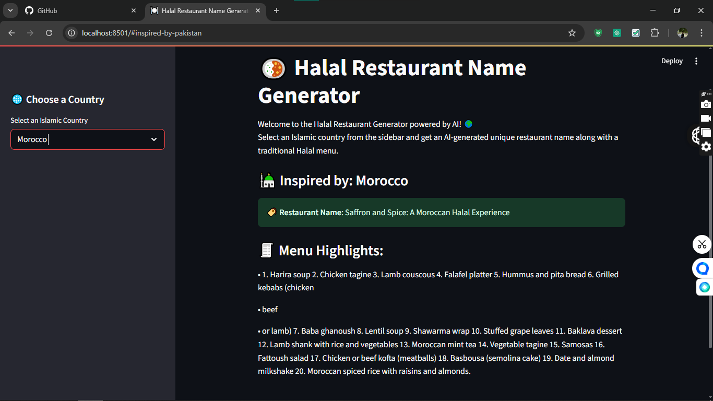
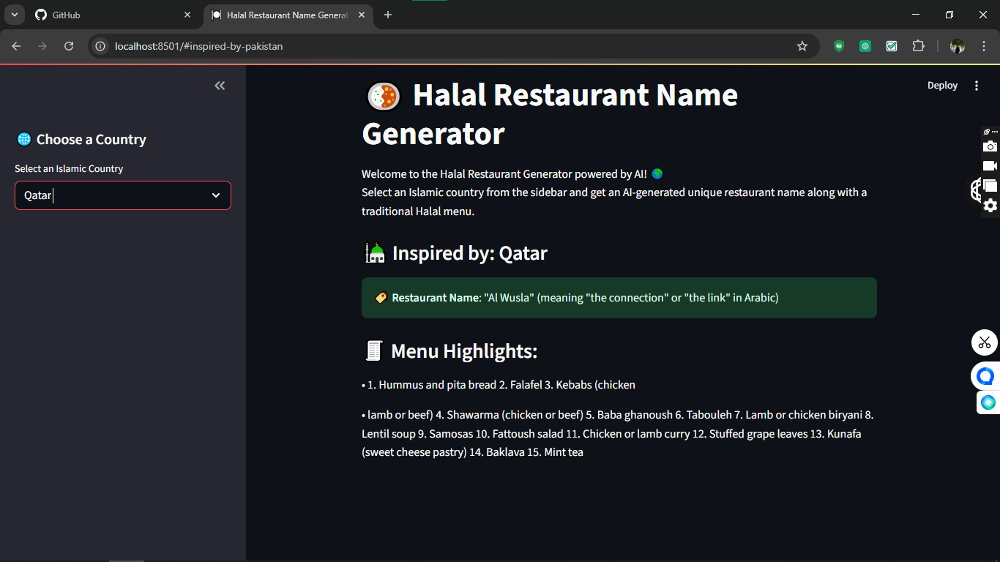
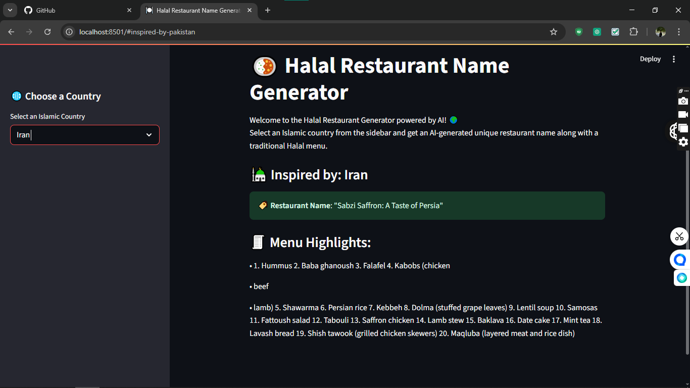

# 🍽️ Halal Restaurant Name Generator

[](https://www.python.org/)
[](https://streamlit.io/)
[](LICENSE)

An AI-powered web app built with **Streamlit** and **LangChain** that generates creative halal restaurant names and traditional menu items based on selected Islamic countries.

---

## 🧠 How It Works

1. Choose an Islamic country from the sidebar.
2. The AI generates:
   - A creative restaurant name inspired by that country’s culture.
   - A traditional halal menu list.
3. View the result instantly!

---

## 🛠️ Technologies Used

- Python
- Streamlit
- LangChain
- OpenAI API (via `.env`)
- python-dotenv

---

## 📁 Project Structure

```plaintext
halal-restaurant-generator/
├── main.py
├── langchain_helper.py
├── requirements.txt
├── .env               # Not included in repo
├── .gitignore
├── README.md
└── assets/            # Screenshots
```
---
## 📷 App Preview

### 🌐 Country Selection Sidebar


### 🇵🇰 When Pakistan is Selected


### 🇲🇦 When Morocco is Selected


### 🇶🇦 When Qatar is Selected


### 🇮🇷 When Iran is Selected


---

📦 Installation & Run
git clone https://github.com/Ibad-Ur-Rahman-Memon/halal-restaurant-generator.git
cd halal-restaurant-generator

# Setup virtual environment
python -m venv .venv
source .venv/bin/activate  # On Windows: .venv\Scripts\activate

# Install dependencies
pip install -r requirements.txt

# Add your OpenAI API key to .env
echo "OPENAI_API_KEY=your_api_key_here" > .env

# Run the app
streamlit run main.py

---
🌍 Islamic Countries Included
Pakistan, Turkey, Indonesia, Saudi Arabia, Morocco, Egypt, Malaysia, Iran, Iraq, Bangladesh, Algeria, Qatar, Jordan, UAE, Afghanistan

---
🙋 Developed By
Ibad Ur Rahman Memon
🔗 GitHub Profile

🔐 License
MIT License © 2025 Ibad Ur Rahman Memon
